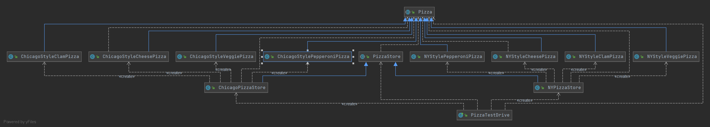

# 工厂方法模式

---
在前一章《设计模式读书笔记—–简单工厂模式》中通过披萨的实例介绍了简单工厂模式。在披萨实例中，如果我想根据地域的不同生产出不同口味的披萨，如纽约口味披萨，芝加哥口味披萨。如果利用简单工厂模式，我们需要两个不同的工厂，NYPizzaFactory、ChicagoPizzaFactory。在该地域中有很多的披萨店，他们并不想依照总店的制作流程来生成披萨，而是希望采用他们自己的制作流程。这个时候如果还使用简单工厂模式，因为简单工厂模式是将披萨的制作流程完全承包了。那么怎么办？

我们可以这样解决：将披萨的制作方法交给各个披萨店完成，但是他们只能提供制作完成的披萨，披萨的订单处理仍然要交给披萨工厂去做。也就是说，我们将createPizza()方法放回到PizzaStore中，其他的部分还是保持不变。

## 一、基本定义
工厂方法模式定义了一个创建对象的接口，但由子类决定要实例化的类是哪一个。工厂方法模式让实例化推迟到子类。

## 二、模式结构
抽象工厂（Abstract Factory）：提供了创建产品的接口，调用者通过它访问具体工厂的工厂方法 newProduct() 来创建产品。  
具体工厂（ConcreteFactory）：主要是实现抽象工厂中的抽象方法，完成具体产品的创建。  
抽象产品（Product）：定义了产品的规范，描述了产品的主要特性和功能。  
具体产品（ConcreteProduct）：实现了抽象产品角色所定义的接口，由具体工厂来创建，它同具体工厂之间一一对应。

工厂方法模式的UML结构图如下：  
//TODO

## 三、工厂方法模式实现
该例的UML结构图如下：  


代码实现：  
抽象产品类
```java
/**
 * 抽象披萨
 * 抽象产品角色
 */
public abstract class Pizza {
    protected String name;      //名称
    protected String dough;     //面团
    protected String sause;     //酱料
    protected List<String> toppings = new ArrayList<String>();      //佐料

    public void prepare() {
        System.out.println("Preparing " + name);
        System.out.println("Tossing dough");
        System.out.println("Adding sause");
        System.out.println("Adding toppings");
        for (int i = 0; i < toppings.size(); i++) {
            System.out.println("   " + toppings.get(i));
        }
    }

    public void bake() {
        System.out.println("Bake for 25 minutes at 350");
    }

    public void cut() {
        System.out.println("Cutting the pizza into diagonal slices");
    }

    public void box() {
        System.out.println("Place pizza in official PizzaStore box");
    }

    public String getName() {
        return name;
    }
}
```
具体产品实现类  
ChicagoStyleCheesePizza
```java
/**
 * 芝加哥风味奶酪披萨
 * 具体产品角色，披萨产品的实现类
 */
public class ChicagoStyleCheesePizza extends Pizza {
    public ChicagoStyleCheesePizza() {
        name = "Chicago Style Deep Dish Cheese Pizza";
        dough = "Extra Thick Crust Dough";
        sause = "Plum Tomato Sauce";
        toppings.add("Shredded Mozzarella Cheese");
    }

    @Override
    public void cut() {
        System.out.println("Cutting the Pizza into square slices");
    }
}
```
NYStyleCheesePizza
```java
/**
 * 纽约风味奶酪比萨
 * 具体产品角色，披萨产品实现类
 */
public class NYStyleCheesePizza extends Pizza {
    public NYStyleCheesePizza() {
        name = "Ny Style Sauce and Cheese Pizza";
        dough = "Thin Crust Dough";
        sause = "Marinara Sauce";
        toppings.add("Crated Reggiano Cheese");
    }
}
```
抽象工厂类  
PizzaStore
```java
/**
 * 披萨店
 * 抽象工厂角色
 */
public abstract class PizzaStore {
    public Pizza orderPizza(String type) {
        Pizza pizza;
        pizza = createPizza(type);
        pizza.prepare();
        pizza.bake();
        pizza.cut();
        pizza.box();
        return pizza;
    }

    abstract Pizza createPizza(String type);        //创建pizza的方法交给子类去实现
}
```
具体工厂实现类  
ChicagoPizzaStore
```java
/**
 * 芝加哥比萨店
 * 具体工厂角色，披萨工厂的实现类
 */
public class ChicagoPizzaStore extends PizzaStore {
    @Override
    Pizza createPizza(String type) {
        Pizza pizza = null;
        if ("cheese".equals(type)) {
            pizza = new ChicagoStyleCheesePizza();
        } else if ("clam".equals(type)) {
            pizza = new ChicagoStyleClamPizza();
        } else if ("pepperoni".equals(type)) {
            pizza = new ChicagoStylePepperoniPizza();
        } else if ("veggie".equals(type)) {
            pizza = new ChicagoStyleVeggiePizza();
        }
        return pizza;
    }
}
```
具体工厂实现类
NYPizzaStore
```java
/**
 * 纽约比萨店
 * 具体工厂角色，披萨工厂的实现类
 */
public class NYPizzaStore extends PizzaStore {
    @Override
    Pizza createPizza(String type) {
        Pizza pizza = null;
        if ("cheese".equals(type)) {
            pizza = new NYStyleCheesePizza();
        } else if ("veggie".equals(type)) {
            pizza = new NYStyleVeggiePizza();
        } else if ("clam".equals(type)) {
            pizza = new NYStyleClamPizza();
        } else if ("pepperoni".equals(type)) {
            pizza = new NYStylePepperoniPizza();
        }
        return pizza;
    }
}
```
工厂类的使用：  
PizzaTestDrive
```java
/**
 * 测试 工厂方法模式
 */
public class PizzaTestDrive {
    public static void main(String[] args) {
        System.out.println("---------Joel 需要的芝加哥的深盘披萨---------");
        PizzaStore chicagoPizzaStore = new ChicagoPizzaStore();       //建立芝加哥的披萨店
        Pizza joelPizza = chicagoPizzaStore.orderPizza("cheese");             //下订单
        System.out.println("Joel ordered a " + joelPizza.getName() + "\n");

        System.out.println("---------Ethan 需要的纽约风味的披萨---------");
        PizzaStore nyPizzaStore = new NYPizzaStore();
        Pizza ethanPizza = nyPizzaStore.orderPizza("cheese");
        System.out.println("Ethan ordered a " + ethanPizza.getName() + "\n");
    }
}
```

## 四、工厂方法模式优缺点
### 优点
（1）在工厂方法中，用户只需要知道所要产品的具体工厂，无须关系具体的创建过程，甚至不需要具体产品类的类名。  
（2）在系统增加新的产品时，我们只需要添加一个具体产品类和对应的实现工厂，无需对原工厂进行任何修改，很好地符合了“开闭原则”。  
### 缺点
（1）每次增加一个产品时，都需要增加一个具体类和对象实现工厂，是的系统中类的个数成倍增加，在一定程度上增加了系统的复杂度，同时也增加了系统具体类的依赖。  
（2）类的个数容易过多，增加复杂度。  
（3）增加了系统的抽象性和理解难度。  
（4）抽象产品只能生产一种产品，此弊端可使用抽象工厂模式解决。

## 五、工厂方法模式的适用场景
（1）一个类不知道它所需要的对象的类。在工厂方法模式中，我们不需要具体产品的类名，我们只需要知道创建它的具体工厂即可。  
（2）一个类通过其子类来指定创建那个对象。在工厂方法模式中，对于抽象工厂类只需要提供一个创建产品的接口，而由其子类来确定具体要创建的对象，在程序运行时，子类对象将覆盖父类对象，从而使得系统更容易扩展。  
（3）将创建对象的任务委托给多个工厂子类中的某一个，客户端在使用时可以无须关心是哪一个工厂子类创建产品子类，需要时再动态指定。

## 六、总结
（1）工厂方法模式完全符合“开闭原则”。  
（2）工厂方法模式使用继承，将对象的创建委托给子类，通过子类实现工厂方法来创建对象。  
（3）工厂方法允许类将实例化延伸到子类进行。  
（4）工厂方法让子类决定要实例化的类时哪一个。在这里我们要明白这并不是工厂来决定生成哪种产品，而是在编写创建者类时，不需要知道实际创建的产品是哪个，选择了使用哪个子类，就已经决定了实际创建的产品时哪个了。  
（5）在工厂方法模式中，创建者通常会包含依赖于抽象产品的代码，而这些抽象产品是、由子类创建的，创建者不需要真的知道在制作哪种具体产品。

---
参考文章：  
[【设计模式读书笔记】工厂方法模式 | 芋道源码 —— 纯源码解析博客 (iocoder.cn)](https://www.iocoder.cn/DesignPattern/xiaomingge/Factory-Method/)