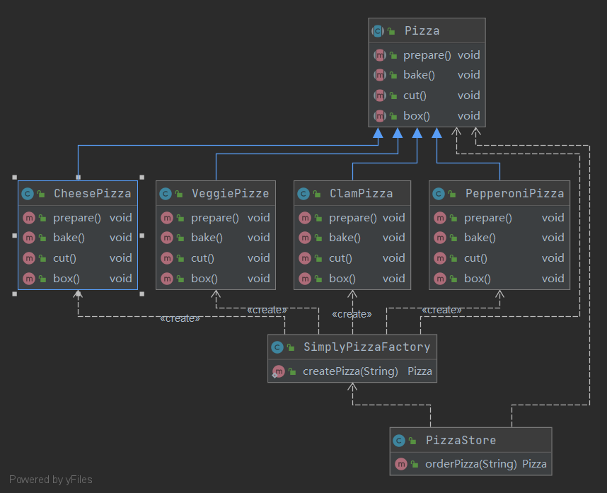

# 简单工厂模式

---
在设计原则中有这样一句话“我们应该针对接口编程，而不是正对实现编程”。但是我们还是在一直使用new关键字来创建一个对象，这不就是在针对实现编程么？

针对接口编程，可以隔离掉以后系统可能发生的一大堆改变。入股代码是针对接口而写，那么可以通过多态，它可以与任何新类实现该接口。但是，当代码使用一大堆的具体类时，等于是自找麻烦，因为一旦加入新的具体类，就必须要改变代码。在这里我们希望能够调用一个简单的方法，我传递一个参数过去，就可以返回给我一个相应的具体对象，这个时候我们就可以使用简单工厂模式。

## 一、基本定义
简单工厂模式又称之为静态工厂方法，属于创建型模式。在简单工厂模式中，可以根据传递的参数不同，返回不同类的实例。简单工厂模式定义了一个类，这个类专门用于创建其他类的实例，这些被创建的类都有一个共同的父类。

简单来说就是，定义了一个创建对象的类，由这个类来封装实例化对象的行为，根据传递的参数不同，返回不同类的实例。

## 二、模式结构
简单工厂（SimpleFactory）：是简单工厂模式的核心，负责实现创建所有实例的内部逻辑。工厂类的创建产品类的方法可以被外界直接调用，创建所需的产品对象。  
抽象产品（Product）：是简单工厂创建的所有对象的父类，负责描述所有实例共有的公共接口。  
具体产品（ConcreteProduct）：是简单工厂模式的创建目标。

简单工厂模式的UML结构图如下：  
//TODO

## 三、简单工厂模式实现
模式场景：在一个披萨店中，要根据不同客户的口味，生产不同的披萨，如素食披萨、希腊披萨等披萨。

该例的UML结构图如下:

代码实现：  
抽象产品父类  
Pizza
```java
/**
 * 披萨
 * 抽象产品角色。为所有产品的父类
 * 定义披萨具有的抽象方法，供子类实现具体方法
 */
public abstract class Pizza {
    public abstract void prepare();//准备

    public abstract void bake();//烤

    public abstract void cut();//切

    public abstract void box();//打包
}
```

具体产品实现类  
CheesePizza
```java
/**
 * 芝士披萨
 * 具体的产品角色，披萨产品的实现类
 */
public class CheesePizza extends Pizza {
    @Override
    public void prepare() {
        System.out.println("prepare CheesePizza ...");
    }

    @Override
    public void bake() {
        System.out.println("bake CheesePizza ...");
    }

    @Override
    public void cut() {
        System.out.println("cut CheesePizza ...");
    }

    @Override
    public void box() {
        System.out.println("box CheesePizza ...");
    }
}
```
ClamPizza
```java
/**
 * 蛤蜊披萨
 * 具体的产品角色，披萨产品的实现类
 */
public class ClamPizza extends Pizza {
    @Override
    public void prepare() {
        System.out.println("prepare ClamPizza ...");
    }

    @Override
    public void bake() {
        System.out.println("bake ClamPizza ...");
    }

    @Override
    public void cut() {
        System.out.println("cut ClamPizza ...");
    }

    @Override
    public void box() {
        System.out.println("box ClamPizza ...");
    }
}
```
PepperoniPizza
```java
/**
 * 意大利辣香肠比萨
 * 具体的产品角色，披萨产品的实现类
 */
public class PepperoniPizza extends Pizza {
    @Override
    public void prepare() {
        System.out.println("prepare PepperoniPizza ...");
    }

    @Override
    public void bake() {
        System.out.println("bake PepperoniPizza ...");
    }

    @Override
    public void cut() {
        System.out.println("cut PepperoniPizza ...");
    }

    @Override
    public void box() {
        System.out.println("box PepperoniPizza ...");
    }
}
```
工厂类  
SimplyPizzaFactory
```java
/**
 * Pizza制造工厂
 * 工厂角色。专门用于创建实例类的工厂，
 * 提供一个方法，该方法根据传递的参数不同返回不同类的具体实例
 */
public class SimplyPizzaFactory {
    //在简单工厂模式中创建实例的方法通常为静态（static）方法
    public static Pizza createPizza(String type) {
        Pizza pizza = null;
        if ("cheese".equals(type)) {
            pizza = new CheesePizza();
        } else if ("clam".equals(type)) {
            pizza = new ClamPizza();
        } else if ("pepperoni".equals(type)) {
            pizza = new PepperoniPizza();
        } else if ("veggie".equals(type)) {
            pizza = new VeggiePizze();
        }
        return pizza;
    }
}
```
工厂类的使用：  
披萨店
```java
/**
 * 披萨店
 * 使用简单工厂模式，创建具体披萨对象
 */
public class PizzaStore {
    public Pizza orderPizza(String type) {
        Pizza pizza;
        //使用工厂对象的创建方法，而不是直接new。这里不再使用具体实例化
        pizza = SimplyPizzaFactory.createPizza(type);
        pizza.prepare();
        pizza.bake();
        pizza.cut();
        pizza.box();
        return pizza;
    }
}
```

## 四、简单工厂模式的优缺点
### 优点
（1）简单工厂模式实现了对责任的分割，提供了专门的工厂类用于创建对象。  
（2）客户端无须知道所创建的具体产品类的类名，只需要知道具体产品类所对应的参数即可，对于一些复杂的类名，通过简单工厂模式可以减少使用者的记忆量。  
（3）通过引入配置文件，可以在不修改任何客户端代码的情况下更换和增加新的具体产品类，在一定程度上提高了系统的灵活性。
### 缺点
（1）由于工厂类集中了所有产品创建逻辑，一旦不能正常工作，整个系统都要受到影响。  
（2）使用简单工厂模式将会增加系统中类的个数，在一定程序上增加了系统的复杂度和理解难度。  
（3）系统扩展困难，一旦添加新产品就不得不修改工厂逻辑，在产品类型较多时，有可能造成工厂逻辑过于复杂，不利于系统的扩展和维护。  
（4）简单工厂模式由于使用了静态工厂方法，造成工厂角色无法形成基于继承的等级结构。  

## 五、简单工厂模式的适用场景
（1）工厂类负责创建的对象比较少。  
（2）客户端只知道传入工厂类的参数，对于如何创建对象不关心。  

## 六、总结
（1）简单工厂模式的要点就在于当你需要什么，只需要传入一个正确的参数，就可以获取你所需要的对象，而无须知道其创建细节。  
（2）简单工厂模式最大的优点在于实现对象的创建和对象的使用分离，但是如果产品过多时，会导致工厂代码非常复杂。  
（3）简单工厂模式有一个问题就是，类的创建依赖工厂类，也就是说，如果想要拓展程序，必须对工厂类进行修改，这违背了开闭原则，所以，从设计角度考虑，有一定的问题，如何解决？我们可以定义一个创建对象的抽象方法并创建多个不同的工厂类实现该抽象方法，这样一旦需要增加新的功能，直接增加新的工厂类就可以了，不需要修改之前的代码。这种方法也就是我们接下来要说的工厂方法模式。  
（4）在简单工厂模式中创建实例的方法通常为静态（static）方法，因此简单工厂模式（Simple Factory Pattern）又叫作静态工厂方法模式（Static Factory Method Pattern）。  
（5）简单来说，简单工厂模式有一个具体的工厂类，可以生成多个不同的产品，属于创建型设计模式。简单工厂模式不在 GoF 23 种设计模式之列。  
（6）简单工厂模式每增加一个产品就要增加一个具体产品类和一个对应的具体工厂类，这增加了系统的复杂度，违背了“开闭原则”。

---
参考文章：
[【设计模式读书笔记】简单工厂模式 | 芋道源码 —— 纯源码解析博客 (iocoder.cn)](https://www.iocoder.cn/DesignPattern/xiaomingge/Simple-Factory-Pattern/)